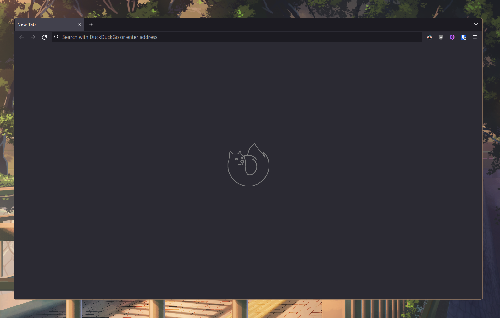

<h1>cleanfox-css</h1>

A minimal Firefox userChrome configuration.

  

## Installation

- Go to "about:config" and set "toolkit.legacyUserProfileCustomizations.stylesheets" to "true"
- Go to "about:support", locate your Profile Directory and open it
- Copy the "chrome" folder to your Profile Directory
- Restart Firefox and enjoy! :)
